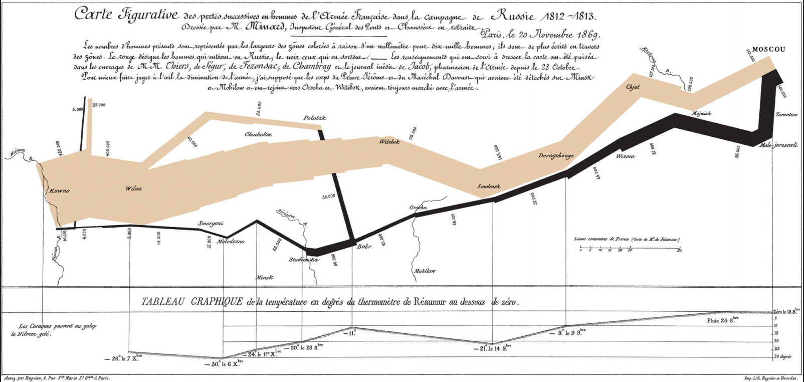
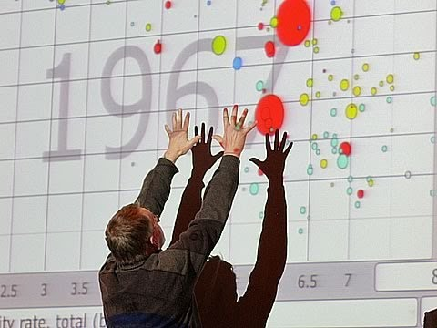
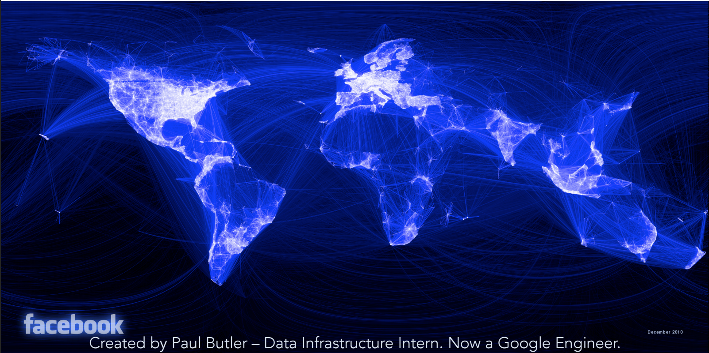

# Meetup recap

Most of this comes (with permission) from Lisa Shiller's talk here on Tuesday
night. I can supply her better slide deck to anyone who is interested.

# What is data viz?

Placing data in visual context

> “Visualizing data is like photography. Instead of starting with a blank canvas, you manipulate the lens
> used to present the data from a certain angle.”
>
> Paul Butler, Engineer at Google NYC

Napolean's March in Russia

The Best Stats You've Ever Seen

Vizualizing the facebook network

# Graph Guidelines
1) Use physical dimensions judged without bias. Be mindful of perceptual illusions.

# Graph Guidelines
2) Consider the task: Know the intention of the graph and what information you want to communicate.

# Graph Guidelines
3) Minimize the number of mental operations: Reduces mental workload and error in judgment.

# Graph Guidelines
4) Keep the data-ink ratio high: Minimize the amount of ink that does not depict actual data points or the relation between those points. Eliminate clutter.

# Graph Guidelines
5) Code multiple graphs consistently: Allow the reader to relate multiple graphs together so it can paint a larger picture.
