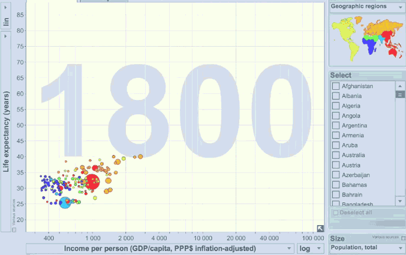

# Meetup recap

I was going to recap Lisa Shiller's talk here on Tuesday
night. She's doing an L&L next week, so let's do a primer.

# What is data viz?

Placing data in visual context

> The idea is to go from numbers to information to understanding.
>
> Hans Rosling

[Flowing Data](http://flowingdata.com/) is a great site for checking this stuff
out.

[beyond the sea - Andy Woodruff](http://andywoodruff.com/blog/beyond-the-sea/)

[ruby throated hummingbird migration](http://www.hummingbirds.net/map.html)

[nearest airport - Jason Davies](http://knowmore.washingtonpost.com/2014/04/11/a-crazy-looking-map-that-always-shows-you-where-the-nearest-airport-is/)

[The Best Stats You've Ever Seen - Hans Rosling](https://www.ted.com/talks/hans_rosling_shows_the_best_stats_you_ve_ever_seen?language=en)
